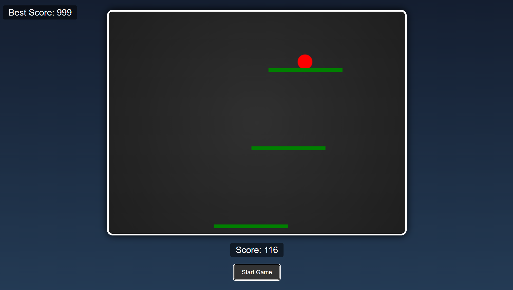

# Ball Jump Game with HTML, CSS, and JavaScript

## 🎮 Project Overview

This project demonstrates how to create a fun and interactive ball jump game using HTML, CSS, and JavaScript. The game challenges players to navigate a ball across moving platforms while avoiding obstacles. It’s a great way to practice web development skills and learn more about game development in the browser.



## ✨ Features

- **Dynamic Game Play**: Platforms move continuously, and the ball jumps from platform to platform.
- **Difficulty Scaling**: As the player's score increases, the game speed and difficulty also increase.
- **Score Tracking**: The game tracks and displays the current score and the best score.
- **Game Over Conditions**: The game ends if the ball falls off the platform or hits a pin obstacle.
- **Responsive Design**: The game canvas adapts to different screen sizes.

## 📜 Table of Contents

- [Project Overview](#project-overview)
- [Features](#features)
- [Installation](#installation)
- [Usage](#usage)
- [Game Mechanics](#game-mechanics)
- [Customization](#customization)
- [Contribution](#contribution)
- [License](#license)

## 📦 Installation

To set up and run this project locally, follow these steps:

1. **Clone the Repository**:
    ```bash
    git clone https://github.com/Coding-Shanks/ball-jump-game.git
    cd ball-jump-game
    ```

2. **Open the Project**:
    - You can open the project in your favorite code editor, such as VSCode.

3. **Run the Game**:
    - Simply open the `index.html` file in a web browser to start the game.

## 🚀 Usage

### Playing the Game

1. **Start the Game**:
    - Click the "Start Game" button to begin.
  
2. **Control the Ball**:
    - Use the **left** and **right arrow keys** to move the ball.
  
3. **Avoid Obstacles**:
    - Jump from platform to platform and avoid falling off or hitting the pins.

4. **Game Over**:
    - The game ends if you fall or hit a pin. Click "Start Over" to play again.

### Game UI

- **Score Display**: Your current score is shown in the top right corner.
- **Best Score**: The best score is also displayed, allowing you to track your highest achievements.

## ⚙️ Game Mechanics

- **Gravity and Bounce**: The ball's movement is influenced by gravity, and it bounces when it hits platforms.
- **Platform Generation**: New platforms are generated dynamically as the game progresses.
- **Difficulty Increase**: The game's difficulty increases by speeding up the platforms and making the ball move faster as the score increases.

## 🎨 Customization

You can easily customize the game by modifying the code:

- **Change Platform Colors**: Adjust the `ctx.fillStyle` in the `drawPlatforms` function.
- **Modify Ball Speed**: Change the `ballMoveSpeed` variable to adjust the ball’s speed.
- **Add More Obstacles**: Introduce new obstacles by adding more logic to the `pins` array.

## 🌟 Contribution

Contributions are welcome! If you have suggestions or improvements, feel free to submit a pull request or open an issue.

### How to Contribute

1. **Fork the Repository**:
    Click the "Fork" button at the top right of the repository page.

2. **Clone Your Fork**:
    ```bash
    git clone https://github.com/Coding-Shanks/ball-jump-game.git
    cd ball-jump-game
    ```

3. **Create a Branch**:
    ```bash
    git checkout -b feature/new-feature
    ```

4. **Make Changes**:
    Implement your changes and commit them.

5. **Push Changes**:
    ```bash
    git push origin feature/new-feature
    ```

6. **Submit a Pull Request**:
    Go to the original repository and create a pull request from your fork.

## 📄 License

This project is licensed under the MIT License. See the [LICENSE](LICENSE) file for more details.

---

Feel free to modify and expand this `README.md` file as needed to better suit your project and any additional features you may implement in the future. This should provide a clear and comprehensive guide for anyone looking to use, understand, or contribute to your game.
